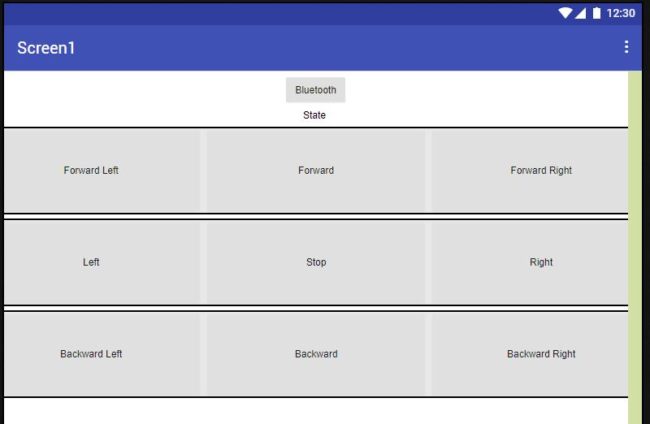
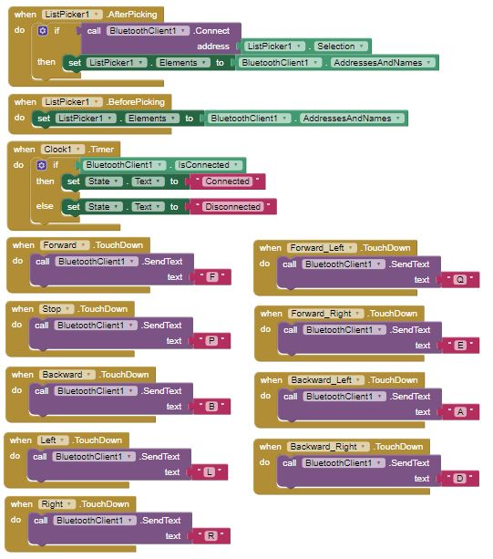

# Informe Coche Teledirigido
## 1. Introducción
El proyecto consiste en la construcción y programación de un coche teledirigido controlado mediante el procesador ESP-32 y una aplicación móvil vía Bluetooth. Este proyecto tiene como objetivo principal demostrar el funcionamiento básico de un sistema de control remoto usando microcontroladores y comunicación inalámbrica.
## 2. Componentes del coche teledirigido
**Procesador ESP-32**

El ESP-32 es un potente microcontrolador con capacidades Wi-Fi y Bluetooth, ideal para proyectos de IoT y sistemas embebidos. En este proyecto, se utiliza para recibir comandos de la aplicación móvil y controlar los motores del coche.

**Kit del Coche**

El kit incluye:
- 4 ruedas: Proporcionan movilidad al coche.
- Carcasa: Soporta todos los componentes del coche.
- Dos motores: Proporcionan la tracción necesaria para el movimiento.
- Pilas: Suministran la energía necesaria para el funcionamiento del coche y los motores.

**Controlador de motor de corriente continua (L298N)**

Su propósito principal es controlar la velocidad del motor a través de Modulación de Ancho de Pulso (PWM).
El controlador ajusta la velocidad del motor variando la frecuencia y el ciclo de trabajo de los pulsos de volatje que alimentan el motor. Un ciclo de trabajo más alto significa una velocidad més alta y viceversa.
El L298N incoropora sistemas de seguridad como protección contra sobretensión y protección térmica.

**Aplicación Móvil**

Una aplicación móvil se utiliza para enviar comandos al ESP-32 vía Bluetooth, permitiendo el control remoto del coche.

## 3. Configuración del Hardware
**Montaje del coche**
1. Monta las ruedas y los motores en la carcasa del coche.

2. Conecta los motores a los pines del ESP-32 según la configuración especificada en el código.

**Conexión de los Componentes al ESP-32**

1. Motores: Conecta los motores a los pines del ESP-32. 

   - Motor 1: Pin1 (15) y Pin2 (2)
   - Motor 2: Pin3 (4) y Pin4 (0)

2. Batería externa: Conectar la batería para alimentar el ESP-32 y los motores.

## 4. Programación del coche
El código utilizado es el siguiente:
```c
#include <Arduino.h>
#include "BluetoothSerial.h"

int Pin1 = 15; //P
int Pin2 = 2; //N
int Pin3 = 4; //P
int Pin4 = 0; //N

BluetoothSerial SerialBT;
char t;

void setup() 
{
    pinMode(Pin1, OUTPUT);
    pinMode(Pin2, OUTPUT);
	pinMode(Pin3, OUTPUT);
    pinMode(Pin4, OUTPUT);
    Serial.begin(115200);
    SerialBT.begin("ESP32RubenJoan");
    delay(500);
    Serial.println("ESP32 en busqueda");

    ledcSetup(0, 5000, 8); //Canal, frecuencia y resolución de 8 bits
	ledcSetup(1, 5000, 8);
	ledcSetup(2, 5000, 8);
	ledcSetup(3, 5000, 8);

	ledcAttachPin(Pin1, 0);
	ledcAttachPin(Pin2, 1);
	ledcAttachPin(Pin3, 2);
	ledcAttachPin(Pin4, 3);
}

void loop() 
{
    if(SerialBT.available())
    {
      t = SerialBT.read();
      Serial.println(t);

		if(t == 'F')
		{
			
			ledcWrite(0, 0);
			ledcWrite(1, 200); 
			ledcWrite(2, 0);
			ledcWrite(3, 200); 
			Serial.println("Front"); //Front
		}

		else if (t == 'P')
		{
			ledcWrite(1, 0);
			ledcWrite(0, 0); 
			ledcWrite(2, 0);
			ledcWrite(3, 0);
			Serial.println("Stop"); //Stop
		}

		else if (t == 'E')
		{
			
			ledcWrite(1, 210); 
			ledcWrite(2, 0);
			ledcWrite(3, 135);
			Serial.println("Forward Right"); //Forward Righ
		}

		else if (t == 'Q')
		{
			ledcWrite(0, 0);
			ledcWrite(1, 135); 
			ledcWrite(2, 0);
			ledcWrite(3, 210);
			Serial.println("Forward Left"); //Forward Left
		}

		else if (t == 'R')
		{
			ledcWrite(0, 0);
			ledcWrite(1, 200); 
			ledcWrite(2, 200);
			ledcWrite(3, 0);
			Serial.println("Right"); //Right
		}

		else if (t == 'L')
		{
			ledcWrite(0, 200);
			ledcWrite(1, 0); 
			ledcWrite(2, 0);
			ledcWrite(3, 200);
			Serial.println("Left"); //Left
		}

		else if (t == 'B')
		{
			ledcWrite(0, 200); 
			ledcWrite(1, 0);
			ledcWrite(2, 200);
			ledcWrite(3, 0);
			Serial.println("Backward"); //Backward
		}

		else if (t == 'A')
		{
			ledcWrite(0, 135); 
			ledcWrite(1, 0);
			ledcWrite(2, 210);
			ledcWrite(3, 0);
			Serial.println("Backward Left"); //Backward Left
		}

		else if (t == 'D')
		{
			ledcWrite(0, 210); 
			ledcWrite(1, 0);
			ledcWrite(2, 135);
			ledcWrite(3, 0);
			Serial.println("Backward Right"); //Backward Right
		}
		
		delay(100);
	}
}
```

Analizamos el código.
1. **Inclusión de librerías**
   - Incluye la biblioteca principal de Arduino.
   - Inlcuye la biblioteca para usar el Bluetooth en el ESP-32.
2. **Declaración de pines** 
    - `int Pin1, Pin2, Pin3, Pin4` son los pines del ESP-32 conectados a los motores.
    - `BluetoothSerial SerialBT` es el objeto para manejar comunicación Bluetooth.
    - `char t` es la variable para almacenar los comandos recibidos por Bluetooth.
3. **Configuración inicial / Función setup()**
   - `pinMode(Pin1, OUTPUT)`: Configura los pines como salidas.
   - Inicializamos la comunicación serial a 115200 baudios.
   - `SerialBT.begin("ESP32RubenJoan")`: Inicializa el Bluetooth con el nombre "ESP32RubenJoan".
   - `ledcSetup(canal, frecuencia, resolución)`: Configura los canales PWM con frecuencia de 5000 Hz y resolución de 8 bits. Para tener 255 pasos, es decir 255 "cambios de frecuencia".
   - `ledcAttachPin(pin, canal)`: Asocia los pines a los canales PWM.
4. **Bucle principal / Función loop()**
   - `if(SerialBT.available())`: Verifica si hay datos disponibles en el Bluetooth.
   - `t = SerialBT.read()`: Lee el comando recibido.
   - `Serial.println(t)`: Imprime el comando recibido en el monitor serial.
   - `ledcWrite(canal, valor)`: Escribe un valor PWM en el canal especificado. Controla la velocidad del motor.
   - **Comandos y acciones:**
     - **F**: Avanza.
     - **P**: Detiene.
     - **E**: Avanza a la derecha.
     - **Q**: Avanza a la izquierda.
     - **R**: Gira a la derecha.
     - **L**: Gira a la izquierda.
     - **B**: Retrocede.
     - **A**: Retrocede a la izquierda.
     - **D**: Retrocede a la derecha.

## 5. Control del coche mediante la aplicaión móvil

La aplicación se ha creado usando un programario web llamado "MIT App Inventor", que permite crear una app de manera senzilla y visual.
Las funciones principales de MIT App Inventor son:
1. Interfaz de diseño visual: Permite al usuario arrastrar y soltar componentes como botones, etiquetas, imágenes, etc, a la vez que proporciona una vista previa de cómo se verá la aplicación en el dispositivo móvil.
2. Programación por bloques: Utiliza un lenguaje de programación basado en bloques simplificando el uso y eliminando la necesidad de escribir código manualmente.

La aplicación móvil se ve así:


La programación por bloques de esta misma aplicación sería la siguiente:


1. Se utiliza una lista para mostrar todas las direcciones y nombres de dipositivos bluetooth que tiene el móvil para conectarnos, en este caso, a "ESP32RubenJoan", que será nuestro ESP-32.
2. Se utiliza un reloj para controlar el esado de la conexión bluetooth y mostrar por pantalla si está conectado o viceversa.
3. Finalmente se envían carácteres a través de este mismo protocolo bluetooth para realizar la lectura posteriormente en el ESP-32. Es decir, al pulsar un botón (p.e. "Forward"), la aplicación enía un carácter al ESP-32(p.e. "F").

## 6. Pruebas y resultados
Se realizaron varias pruebas para verificar el correcto funcionamiento del coche teledirigido. 
Vamos a presentar algunos inconvenientes que nos encontramos por el camino:
1. **PWM**: Al empezar el proyecto programamos las salidas de los motores con la función de Arudino `digitalWrite`. Eso supuso un impedimiento para controlar las velocidades a las que debían ir los motores, ya que esta función solo permite dos posiciónes "LOW" (0V) y "HIGH" (5V o 3.3V, dependiendo del microcontrolador). En cambio el PWM permite 255 valores posibles, como hemos explicado antes.
2. **Ciclos de PWM**: Hemos tenido cietos problemas con los valores del PWM, ya que si programabamos los motores con valores de "velocidad" más pequeños de 125, el motor no tenia suficiente fuerza para empezar a girar, por lo tanto, nuestro rango de funcionamiento se reduce en gran mesura. Esto ha hecho que no podamos implementar funciones de variación de velocidad, porque nos quedabamos sin valores posibles.
3. **Tensión**: Finalmente, hemos tenido problemas de sobretensión que hacian que el microcontrolador se reseteara y dejara de funcionar. 
Un ejemplo pordría ser el siguiente: Pulsamos el botón para mover el coche hacía delante y al pulsar el botón para mover el coche hacóa atrás se resetrea el ESP-32 porque ha habido una sobretensión.
Esto también ha afectado al hecho de tener que reducir nuestro margen de velocidades, ya que hemos tenido que bajar las velocidades máximas para no encontrarnos con este preoblema.

En el caso de la comunciación Bluetooth no hemos tenido problema y ha funcionado bien desde el primer día.

## 7. Conclusiones y mejoras futuras
**Conclusiones del Proyecto**

El proyecto demostró que es posible controlar un coche teledirigido utilizando un ESP-32 y una aplicación móvil vía Bluetooth. La implementación fue exitosa y el coche funcionó según lo esperado.
A lo largo del desarrollo, hemos aprendido varias cosas interesantes:
    - Eficiencia del control de motores con PWM.
    - Facilidad de la comunicación Bluetooth.
    - Versatilidad del ESP-32.
    - Creación de aplicaciones móviles senzillas.

En conclusión, este proyecto ha sido una excelente oportunidad para aplicar conocimientos de programación, electrónica y comunicaciones inalámbricas en un sistema práctico y funcional. La combinación del ESP32 con el control de motores mediante PWM y la comunicación Bluetooth ofrece una solución robusta y flexible para una amplia gama de aplicaciones en el campo de la robótica y la automatización.

**Posibles Mejoras Futuras**

1. Mejorar la precisión del control: Ajustar el código para una respuesta más precisa a los comandos.
2. Implementar sensores: Añadir sensores para evitar obstáculos.
3. Mejorar la aplicación móvil: Añadir más funcionalidades y una interfaz de usuario más amigable.
